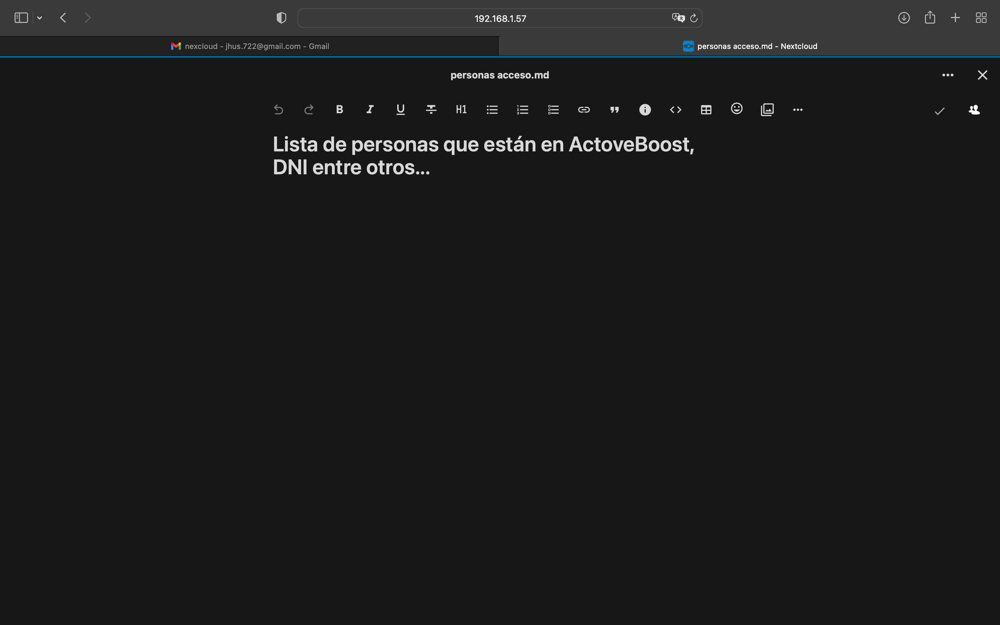

# Proyecto M12

## 1. Valorar proyecto:

- Lo primero sería pensar qué proyecto sería el indicado para aprobar la asignatura y sea compatible, así que pensé en los trabajos de la mayoría de mis compañeros y
 decidí montar un negocio de venta de productos, como tos.

- Posibles ideas:
    - Una de mis primeras ideas fue simular el Canódromo, que es la empresa donde hago las prácticas, me pareció buena idea debido a que tengo mucha información sobre ello y además tengo a mi tutor de prácticas para preguntarle sobre varios ámbitos.
    - También pensé en una tienda de suplementación deportiva.
    - También en un gimnasio.

Estas son las ideas que más me convencieron, pero descarte la primera pensando en su complejidad a la hora de ejecutar el plan y me dio miedo no hacerlo del todo bien, ya que el canódromo ofrece diversos servicios y me iba a costar mucho tiempo ejecútalo, y el tiempo es lo que me faltaba.

Opté por la segunda opción debido a que me pareció la más asequible al tiempo disponible.

La tercera opción me pareció la más entretenida, pero visto como nos fue con la peluquería, mejor opté por la segunda.

### 1.1 Valorar nombre de la empresa:

- Primero hagamos un listado de posibles nombre originales:

    - FitSupp
    - SupremeFit
    - MusclePro
    - VitaSport
    - ElevateNutrition
    - ActiveBoost
    - OptiHealth
    - IronEdge
    - ProVitality
    - PeakFuel
    - EliteSupps
    - PrimeNutrition

Esta es la lista de las opciones recomendadas, al final opte por ActiveBoost, ya que el nombre es pegadizo y además pensé que nuestros productos estrella serán los prework que te activa.

Nuestra Empresa aparte de dedicarse a la venta de suplementos deportivos, también se dedicará a la venta de material de GYM así tendremos más variedad en la tienda.

## 2. Administración de Trabajos

Para este primer día /4/6/23 comencé a pensar en cómo tenía que hacer el proyecto de recuperación, no recibí ninguna instrucción ni respuesta a los mensajes hechos a los maestros, debido a que tengo poco tiempo preferí ya a comenzarlo, pensé que sería como el último proyecto y me puse a ello.

Para comenzar el trabajo primero pensé en crear una plantilla en trello para administrar mi trabajo:

Creé esos trabajos de momento para iniciar mi proyecto.

## 3. Localización

En primer lugar, decidí que mi local estuviera lo más cerca posible a un GYM, ya que mi local tendrá más demanda, porque no en todos los GYM venden suplementos y productos en el mismo recinto.

Dicho lo anterior comencé a buscar un local cerca de un gym y también que esté lo bastante cerca del metro y un centro comercial grande.

Santa Eulalia, L'Hospitalet de Llobregat, con unos 200 y dos plantas m2 a 60.000 €

## 4. Topología de la red y Planos

Comenzaré haciendo un esquema de la red de nuestra empresa con packet tracer y proseguí haciendo nuestros planos.

- Principalmente tendremos tres redes:

    - Para los clientes, por si quieren conectarse a nuestro WIFI montamos un AccesPoint: 192.168.6.0/24
    - Para nuestro Servicio tecnico, “equipos y servidores entre otros”: 192.168.5.0/24
    - Para nuestros administradores y que encargan del papeleo y esas cosas: 192.168.4.0/24

- Configuraciones hechas para el AccesPoint

- Planos de nuestro Local hechos con FloorPlaner:

Primero comenzamos creando el local "ActiveBoost":

Lo equipamos con muebles y le añadimos una receoción.

Para finalizar con los planos proseguimos cerando la oficina que dirige el local:

Me inspire en la empresa donde hago las practicas, y posiblemente también copie algunos de sus servicios entre otros.

El cableado irá por las paredes, el router se encontrará en la sala de servidores/rack, esta repartira las IP a la sala Tecnica y oficina Tecnica con diferentes IP repartida por switches y tambié a la sala de vigilancia, reuniones, recepción y a los AccesPoint para el local ActiveBoost.

- Resumen:

    - Servico tecnico, rack de servidores, sala vigilancia -> 192.168.5.0/24

    - Oficina Tecnica, recepción -> 192.168.4.0/24

    - Para los AccesPoint, uno alado de recepción y el otro a la entrada al local --> 192.168.6.0/24 

## 5. Instalar Proxmox en una MV

Primero pillamos una iso de la página oficial´de proxmox https://enterprise.proxmox.com/iso/ 
Proseguimos por arrancar la iso en Virtualbox y seguimos con las configuraciones.

Nos instalamos un CT, en mi caso Ubuntu

## 6. Instalación de servicios "solo necesarios para ActiveBoost" 

En el anterior proyecto yo me encargue de todas las que se tenian que hacer, yo me encrague de hacer desde la primera a la ultima, exepto algunas que no salkieron, pero ahora decidi que solo pondria las necesarias y algunas que que no estaban en la instalación del anterior proyecto.

- Me vase en 6 puntos:

    - Mensageria, que lo haré con postfix
    - Mensageria instantanea que lo haré con matermost
    - Software de gestión empresarial, SAP Business One, esta erramienta es muy util ya que es una solución única y asequible para gestionar toda pequeña empresa desde contabilidad y finanzas, compras, inventario, ventas y relaciones con los clientes hasta informes y análisis
    - Seguridad fisica y lógica, para la segurida física creare las medidas de seguridad e instalare un servidor en el cual pueda acceder a las camaras de seguridad 
    ZoneMinder que es la que tenemos montada en el canodrom, tambie necesitariamos targetas de acceso, es decir "CardPass3" su función es limitar el paso a cualquier persona que no tenga esta targeta. Para la seguridad logica bastaria con un wirewall de red en nuestro router que será creado pon PfSense.
    - Servicio de copias de seguridad y almacenamiento, nosotros tenemos montado una "raid 5" y aparte tambien tenemos instalado el "proxmox backup" que remplace esta opción enves del TrueNas. Cabe destacra que también tenemos las backups en la nube.
    - Servicios de logisticca, Manhattan Associates nos facilitará muchisimo la administración del almacén , tambien estube pensando en instalar un nexcloud para el 
    servivio tecnico y otro para la oficina tecnica.
    - Tambien haremos uso de apache2 para la web.

Psiblemente no acabe de instalar todos estos servicios ya que no dispongo del tiempo y conocimiento y material necesario, pero llegare hasta donde se pueda, le dare más inportancia a los mas necesarios para el funcionamiento de la empresa ActiveBoost.

Cabe destacar que aqui no haré la cnfiguración de DNS y DHCP porque ya las hice en el anterior proyecto, y daremos por hecho que ya están instalados. También, los servicios desconocidos mencionados antes me recomendo Alfons("Tutor de précticas") que se encraga de todo el canodrom, le pregunte estas cosas para que mi empresa tenga más sentido, que creo que era eso lo que fallaba en el anterior proyecto.

### 6.1 Instalación y configuración de servidor Mattermost:

- Comenzamos con buscar si se puede instalar con docker-compose para facilitarnos el trabajo, si se puede, el script para el containet de docker-compose.yml me lo proporciono chat-gpt, lo que se usa seria mb y matermost:

En la imagen se puede apresiar como ejecutamos el container docker-compose.yml que tiene el siguiente contenido:

También qui podemos observar que no nos dio ninngun error y podemos ver los contenedores que fueron ejecutados:

- Ahora pasemos al servidor:

Ahora abrimos un navegador y ponemos la ip del server-ubuntu donde tenemos montado el matermost con el puerto :8065 y al entrar lo primero que nos pude es crear una cuenta administrador y despues una "Team" nueva, en nuestro caso ActiveBoost

Y aquí podemos ver que ya se creo:

En la siguiente imagen se muestra algunos chanels que son los mas importantes, oficina tecnica: solo pa los que se encargan del papeleo y administración entre otros, servicio técnico: para el chat del los encragados del correcto funcionamiento de los servidores, impresoras, web... entre otros, town square: que es una chanel para que todos dentro del servidor lo vean, y por ultimo off-topic: que una chanel que no está relacionada con el trabajo.

cabe destacar que este es la beta, después con el tiempo lo mejoraremos todo.

Otra cosa conveniente al usar mattermost es que tiene "boards" en cada chanel, para asignar tareas con una fecha, importancia entre otros, y admeás también puedes hacer llamadas, la mensageria instantanea ideal para una empresa.

Estos solo son algunas cosas de las cuales haremos uso, pero mattermost ofece mucho más.

### 6.2 Instalación y configuración Nexcloud, para servicio técnico y oficina técnica

En este apartado lo que haremos será crear otro container y subirlo con docker compose, como hicimos con matermost.

La siguiente imagen mustra el contenido de docker-compose.yml 

Lo que hace es usar la imagen de mariadb como base de datos y nexclaud que indica el puerto y el archivo donde se alojara.

Una vez que veamos que no hay ningun error solo tenemos que poner nuestra ip del server y el puerto 8080, este es el que usamos para nexcloud.

En las siguientes imágenes podemos ver que primero nos logueamos con la cuenta del server y la contraceña creada en mariadb y después ya podemos acceder al nexcloud.

Una vez terminado esto lo que haremos será crear grupos, oficina tecnica, servicio técnico, sala de vídeo vigilancia entre otros. Tambien creamos carpetas para estos. Y por ultimo añadimos usuarios yo añadi al usuario "jhoselin" y le asigne al grupo servicio técnico, y le comparti es acceso a la carpeta servicio técnico al grupo de servicio técnico, es decir al grupo en el que se encuentra el usuario "jhoselin". Accedí desde otro orenador, me loguee con la cuenta, y me salía la la carpeta de servicio técnico y las subcarpetas creadas.

Aqui las imagenes del otro ordenador:

Al parecer no le comparti solo la carpeta de servicio técnico, sino de la carpeta "Documents" que es sonde puse todos los demás.

### 6.3. DNS

Yo decidi implementar un servidor DNS para la futura web que se llamara actu¡iveboost.com y necesitamos un servidor DNS para combertir la ip a nombre de dominio.

Configure nuestro servidor DNS con bind9: sudo apt-get install bind9 para descargar el paquete, proseguimos editando el sihuiente archivo.

### 6.4 DHCP

Nosotros instalamos isc-dhcp-server, comenzamos descargando el paquete con apt-get install y procedimos con la edición del archivo /etc/dhcp/dhcpd.conf que nos sirvio para establecer el nombre de dominio.

Esta imagesn también es el mismo archivo de antes, sinó con la diferencia de que este se encrga de configurar el rango de direcciones IP que el servidor DHCP asignará a los clientes

Esto es un poco de lo que hice en el anterior proyecto y lo expliqué mejor ahí.

## 8. Configuración Pfsense y Firewall 

## 9. Página web subida con apache 2 

